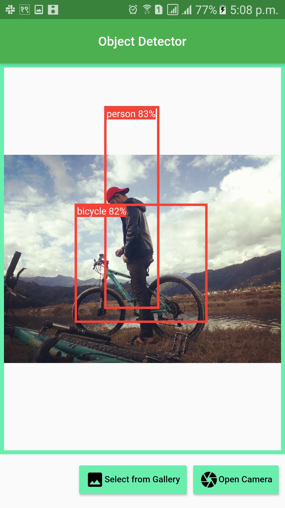
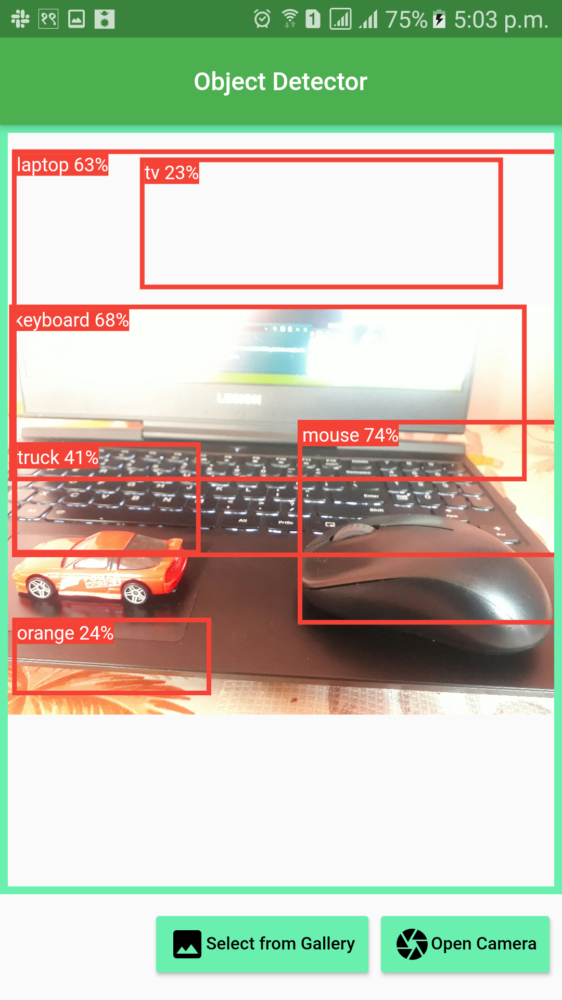

# Object_Detector[Flutter + TensorflowLite + Tiny YOLO V2 + SSD Mobilenet]
 This is a mobile application made using flutter framework which detects object in an image from gallery or camera. It uses SSD Mobilenet and Tiny YOLO V2 module for object detection.
## Plugin Used:
 - tflite
 - image picker
## Module Used:
 - SSD Mobilenet
 - Tiny YOLO V2
## Screenshots:
 
 ### You can find the apk file in this folder[app-release]:
 \build\app\outputs\flutter-apk\
